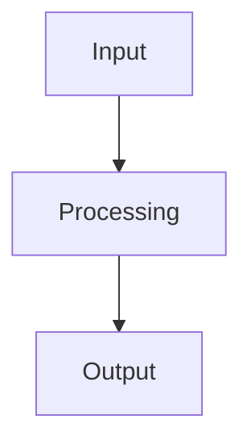

# Architecture

Use this skill when an explicit architecture artifact will make the implementation clearer or reduce design mistakes.

The task statement and user instructions are the primary source of requirements. Do not introduce requirements, technologies, infrastructure, or process that are not justified by the task.

The goal is a concise, practical design artifact that explains how the proposed solution should work and what is actually intended to be implemented.

## Default Location

If the user does not specify a path, prefer:

```text
docs/architecture.md
```

If the repository already uses another documentation convention, follow the existing repository structure instead of forcing this path.

## Inputs

Use only context needed for the design:

- the user's request and task statement;
- explicitly provided files, data, constraints, and acceptance criteria;
- existing repository code or documentation that directly affects the proposed solution.

Do not perform broad repository exploration by default.

If information is missing but the task can still be solved, make a reasonable assumption and state it explicitly. Ask a question only when the missing information blocks a meaningful design decision.

## Procedure

1. Identify the problem, intended behavior, and relevant constraints.
2. Determine what must be implemented versus what can remain design-only.
3. Define inputs, outputs, and the main runtime or artifact flow.
4. Define only the module or service boundaries that materially improve clarity, testability, or replaceability.
5. Define important data contracts and interfaces when they matter.
6. Identify external dependencies and integration boundaries.
7. Capture assumptions, limitations, risks, and meaningful trade-offs.
8. Define how the proposed solution can be validated.
9. Add Mermaid diagrams only when they make the architecture easier to understand.
10. Write or update the architecture document.

Do not implement code as part of this skill unless the user explicitly asks to continue with implementation.

## Architecture Template

Adapt the structure to the task. Remove sections that do not add value.

~~~md
# Architecture - <task or system name>

## Context

<!-- What problem is being solved and in what constraints? -->

## Goal

<!-- What the proposed system should enable. -->

## Inputs and Outputs

### Inputs

- ...

### Outputs

- ...

## Data / Request Flow

<!-- Explain the main runtime or artifact flow. -->



## Components and Responsibilities

| Component / module | Responsibility | Implementation status |
|---|---|---|
| `...` | ... | implemented / planned / mocked |

## Data Contracts

<!-- Add only when structured contracts are important. -->

| Contract / model | Purpose | Key fields / notes |
|---|---|---|
| `...` | ... | ... |

## External Integrations

<!-- APIs, databases, queues, model providers, storage, external systems. -->

| Integration | Purpose | Current handling |
|---|---|---|
| `...` | ... | real / mocked / design-only |

## Assumptions and Decisions

- ...

## Trade-offs and Alternatives

- ...

## Risks and Limitations

- ...

## Validation Expectations

- ...

## Open Questions

- ...
~~~

## Quality Rules

The architecture should be:

- concise enough to understand quickly;
- specific enough to guide implementation;
- explicit about inputs, outputs, boundaries, and responsibilities;
- honest about what is implemented, mocked, or only designed;
- proportional to the scope and time available;
- explicit about assumptions when requirements are incomplete;
- conservative about new services, dependencies, and abstraction layers.

Prefer:

- the simplest architecture that satisfies the task;
- replaceable interfaces around external dependencies when that improves clarity or testability;
- diagrams that explain real flow rather than decorate the document;
- explicit trade-offs when multiple reasonable approaches exist.

Avoid:

- infrastructure added "just in case";
- generic production components without a concrete requirement;
- forcing queues, caches, databases, LLMs, Docker, monitoring, or other technologies into every solution;
- implementation-level pseudocode in an architecture document;
- repeating the task statement without making design decisions;
- presenting mocked or design-only behavior as implemented;
- claiming performance, quality, reliability, or scalability that was not validated.
