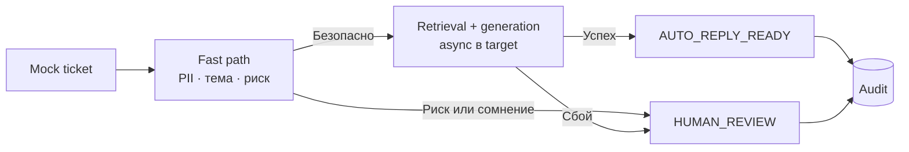

# Автоматизация обработки тикетов — PoC

Локальный вертикальный срез от mock-тикета до безопасного решения и SQLite-аудита.



## Бизнес-ценность

Предложенное решение автоматически маршрутизирует сложные тикеты, а для
безопасных типовых обращений находит проверенное знание и готовит ответ без
участия оператора. Бизнес-гипотеза состоит в том, что автоматизация части из 40%
повторяющихся обращений позволит избежать части операторской обработки,
которая сейчас занимает около 8 минут и стоит 150 ₽ на тикет. Быстрый маршрут и
асинхронный ответ должны снизить риск нарушения SLA первого ответа 15 минут во
время пиков. Эффект считается успешным только без ухудшения CSAT 4,2/5 и reopen
rate 9%; PoC подтверждает механику решения, но не величину экономии.

## Локальный запуск

Требуется Python 3.11 или новее.

```bash
python3 -m venv .venv
./.venv/bin/python -m pip install -e ".[dev]"
./.venv/bin/support-ai-demo --deterministic
./.venv/bin/python -m pytest
```

Demo проходит happy path, риск, low-confidence и отказ генерации. CLI печатает
фактические этапы, а audit сохраняется в игнорируемой Git базе `.data/audit.db`.

## Реальный LLM

Опциональный OpenAI-compatible адаптер настраивается через `.env.example` и
запускается командой `support-ai-demo --scenario happy`. Он допустим только для
синтетических примеров: regex не гарантирует удаление контекстных PII. Ошибка,
timeout или невалидный ответ приводят к `HUMAN_REVIEW`, а не к mock-успеху.

## Что реализовано, а что замокировано

- **Реализовано:** контракты, regex-очистка PII, policy, TF-IDF retrieval,
  генерация и проверки ответа, идемпотентность, SQLite-аудит.
- **PoC-замены:** keyword-классификатор, локальная база знаний и
  детерминированный генератор.
- **Только дизайн:** обученная модель темы, локальный PII detector, очередь,
  управляемая база знаний и интеграция с helpdesk.

## Допущения

- Компания уже использует омниканальную helpdesk-систему как источник истины;
  PoC не реализует channel adapters и отправку ответа.
- Для MVP доступна одобренная и версионируемая база знаний; локальный JSON
  имитирует этот источник.
- Автоматизация начинается с нескольких безопасных информационных тем.
  Платежи, доступ к аккаунту, security, legal и safety всегда требуют человека.
- Все примеры PoC синтетические; качество моделей, пороги и бизнес-эффект должны
  быть подтверждены на данных и в ограниченном пилоте.

## Ограничения

- Тестовые статьи и keyword-правила не доказывают качество модели.
- Нагрузка 200 тысяч тикетов в день и целевая задержка не проверялись.
- Ответ считается готовым к отправке, но PoC не отправляет и не закрывает тикет.

## Документация

[Архитектура](docs/architecture.md) · [ML](docs/ml.md) ·
[Мониторинг](docs/monitoring.md) · [Риски](docs/risks-and-ops.md) ·
[Самооценка](SELF_REVIEW.md)
