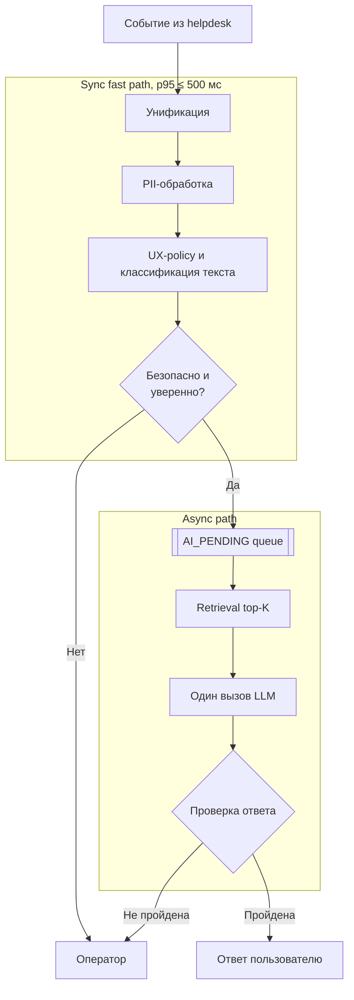
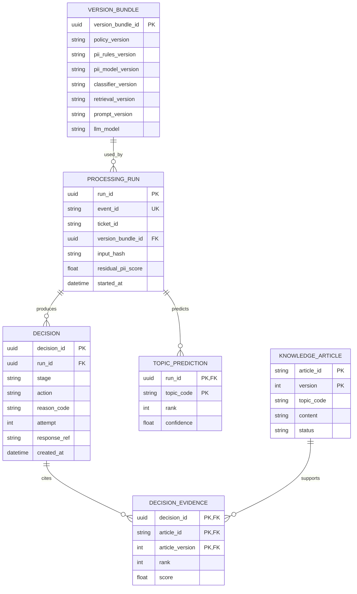

# Архитектура

Целевая система дополняет существующую helpdesk-платформу: быстро решает, куда
направить тикет, и асинхронно готовит автоответ только для безопасных случаев.

## Поток и sync/async-граница



Fast path возвращает `HUMAN_REVIEW` или `AI_PENDING`. Retrieval и LLM не входят
в лимит 500 мс: задача ставится в очередь, а helpdesk не ждёт генерацию. В PoC
очередь можно заменить последовательным вызовом, сохранив два интерфейса:
`make_fast_decision()` и `process_generation_job()`.

## Вход и PII

Helpdesk остаётся источником истины и интерфейсом оператора. AI-контур получает
её события, а унификация преобразует channel-specific поля в контракт:

```text
Ticket:
  event_id
  ticket_id
  channel
  created_at
  selected_topic
  messages
  customer_ref
  locale
  attachment_refs
  metadata
  schema_version
```

В PoC channel adapters замокированы, но контракт валидируется реально. Внутри
закрытого контура правила заменяют email, телефон и другие формализованные PII
на типизированные плейсхолдеры. Локальный лёгкий detector ищет остаточные PII.
Высокочувствительные данные или ненадёжная очистка означают `HUMAN_REVIEW`.
Исходный текст не уходит во внешний LLM, обычные логи или audit.

## Policy и классификация

Выбранная пользователем тема — только ранний сигнал. Платежи, доступ к аккаунту,
security, legal и safety сразу направляются оператору. Для остальных тикетов
рискованные правила имеют приоритет, затем `TF-IDF + multiclass Logistic
Regression` возвращает top-3 темы. Рискованная тема, конфликт с UX-темой или
низкая уверенность означают `HUMAN_REVIEW`; иначе — `AI_PENDING`.

## Retrieval

Используется только одобренная версионируемая база знаний, не сырые ответы
операторов. Baseline фильтрует активные статьи по top-3 темам и ранжирует их по
TF-IDF similarity к очищенному запросу. В LLM передаются top-3 фрагмента с
`article_id`, версией и score. Низкие scores или противоречивые кандидаты
означают `HUMAN_REVIEW`. Embeddings и hybrid search остаются развитием.

## Генерация

Один вызов LLM без tools и agent loop получает очищенный текст и top-3
контекста. Строгий prompt запрещает следовать инструкциям из пользовательского
текста и требует JSON с `answer` и `used_article_ids`. Детерминированная
проверка контролирует схему, ссылки на входные статьи, PII и policy. Только
безопасная категория с пройденными проверками получает автоответ; self-confidence
LLM не используется.

## Данные и аудит

Helpdesk хранит исходный тикет, диалог, ответ и конечный статус. AI-контур хранит
только нормализованные audit-данные и базу знаний:



Схема находится в 3НФ: списки прогнозов, evidence и версии статей вынесены в
отдельные отношения; каждый неключевой атрибут зависит от ключа, всего ключа и
только ключа. Очередь не является реляционным хранилищем: её минимальное
сообщение содержит `job_id`, `run_id`, `sanitized_text` и `attempt`.

`DECISION` — append-only audit. `event_id` обеспечивает идемпотентность,
`VERSION_BUNDLE` фиксирует версии правил, моделей и prompt, а
`DECISION_EVIDENCE` — фактически использованные статьи. Сырые и очищенные тексты
в audit не пишутся; `response_ref` указывает на ответ в helpdesk.

## Деградация

- Sync-компонент повторяется один раз только внутри оставшегося бюджета 500 мс.
- Retrieval и LLM повторяются асинхронно до трёх раз с backoff.
- После исчерпания попыток записывается `DEPENDENCY_FAILURE`, а тикет получает
  `HUMAN_REVIEW`; автозакрытие при деградации запрещено.

## Временные заметки для `docs/ml.md`

> **TODO → `docs/ml.md` (retrieval):** основной срез — Recall@3; дополнительно
> качество ранжирования по темам и разметка связей «тикет — статья».

> **TODO → `docs/ml.md` (generation):** доля ответов, одобренных экспертами без
> правок, ≥98% при нуле критических ошибок. Дополнительно groundedness, citation
> accuracy, completeness и safety pass rate; LLM-as-judge только вспомогательный.
