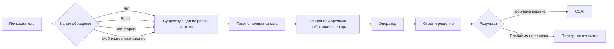
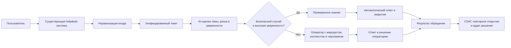

# Продуктовый контекст

## Проблема и границы решения

Сервис получает около 200 тысяч обращений в день из чата, email, веб-формы и
мобильного приложения. Формат обращений неоднороден, часть текста содержит
персональные данные, а во время инцидентов поток может вырасти до 10–20 тысяч
тикетов за 10 минут. При этом около 40% обращений считаются типовыми, но сейчас
каждый тикет требует времени оператора: в среднем 8 минут и 150 ₽.

Проблема бизнеса — не просто отправить ответ быстрее, а увеличить долю
обращений, безопасно решённых в пределах SLA, не ухудшая клиентский опыт.
Система должна автоматически обрабатывать простые повторяющиеся случаи и
передавать сложные или рискованные обращения подходящему оператору.

Система поддержки не устраняет первопричины продуктовых и инфраструктурных
инцидентов. Она распознаёт обращение, предоставляет проверенное решение,
маршрутизирует запрос и формирует сигнал для ответственной команды. Платёжные,
security, legal и другие рискованные случаи не закрываются автоматически.

## Процесс as-is

Основные потери текущего процесса: оператор повторно разбирает типовые вопросы,
неоднородный вход затрудняет маршрутизацию, а всплески обращений увеличивают
очередь и риск нарушения SLA. Стоимость обработки растёт линейно с потоком.
Helpdesk-система уже принимает транспортные форматы каналов и показывает тикеты
в одном интерфейсе, но операторы вручную интерпретируют различающиеся поля,
структуру диалога и метаданные.

## Процесс to-be

На быстром пути система унифицирует вход, определяет тему и риск и принимает
решение о маршруте. Генерация ответа не блокирует маршрутизацию. При низкой
уверенности, рискованной категории или недоступности зависимости сохраняется
обычный операторский процесс.

## Ценность

- **Пользователь:** быстрее получает проверенное решение типового вопроса, а
  сложный запрос сразу попадает к подходящему специалисту.
- **Оператор:** тратит меньше времени на повторяющиеся ответы и получает тему,
  контекст и черновик для сложного обращения.
- **Бизнес:** снижает стоимость безопасно решённого тикета, удерживает SLA во
  время пиков и масштабирует поддержку без линейного роста штата. Потенциальная
  валовая экономия одного полностью автоматизированного тикета — до 150 ₽ до
  учёта inference, эксплуатации и повторных обращений.

## Основная онлайн-метрика

**Доля безопасной автоматизации** — доля всех валидных входящих тикетов, которые:

1. закрыты без участия оператора в пределах 15 минут;
2. не были повторно открыты в течение 7 дней;
3. не привели к нарушению safety-политик.

Метрика считается по категориям и каналам, чтобы изменение структуры потока не
маскировало деградацию. Отсутствие повторного открытия само по себе не доказывает
успех, поэтому метрика оценивается вместе с CSAT и выборочным аудитом ответов.

## Основная offline-метрика

На экспертно размеченной отложенной выборке:

- TP — корректное и допустимое автоматическое закрытие;
- FP — ошибочное, неполное или запрещённое автоматическое закрытие;
- FN — передача оператору тикета, который можно было безопасно автоматизировать;
- TN — корректная передача оператору тикета, требующего человека.

**Offline-цель:** максимизировать покрытие автоматизацией
`(TP + FP) / N` при доле ошибок среди автозакрытий
`FP / (TP + FP) ≤ 2%` и отсутствии обнаруженных критических FP.

Порог 2% — стартовое допущение для пилота, которое должно быть пересмотрено
владельцами поддержки и risk-функцией. FPR `FP / (FP + TN)` используется как
диагностическая, но не основная метрика: большое число TN может скрыть
неприемлемую долю ошибок среди фактически автоматизированных тикетов.

## Защитные метрики

- **CSAT:** снижение не более чем на 0,1 относительно одновременной контрольной
  группы при текущем уровне 4,2/5.
- **Повторное открытие:** не выше текущих 9% для автоматизированной когорты.
- **SLA:** не более 5% тикетов без первого ответа за 15 минут.
- **Ошибочные автозакрытия:** не более 2%; обнаруженных критических
  автозакрытий — 0.
- **Стоимость:** до 15 ₽ inference на один успешно автоматизированный тикет
  как стартовый бюджет, то есть не более 10% стоимости работы оператора.

Защитные метрики служат условиями запуска, расширения и автоматического
отката пилота, а после запуска — метриками постоянного наблюдения.

## Бизнес-ограничения

- Классификация и маршрутизация должны укладываться в p95 до 500 мс; генерация
  ответа может выполняться асинхронно.
- Система должна принимать около 200 тысяч тикетов в день и переживать всплеск
  примерно до 33 тикетов/с без потери обращений.
- Низкая уверенность, рискованная категория или сбой LLM всегда приводят к
  передаче оператору, а не к автоматическому закрытию.
- Необработанные персональные данные нельзя передавать во внешний LLM API.
- Автоматические решения должны быть воспроизводимы и доступны для аудита.
- Стоимость LLM должна ограничиваться маршрутизацией запросов, бюджетами и
  наблюдением, а не расти пропорционально всему входящему потоку.

## Продуктовая гипотеза: выбор темы без свободного текста

Текущий контур предполагает, что пользователь пишет обращение, а система
определяет его тему. Альтернатива — провести пользователя по дереву тем и подтем,
как в каталоге услуг, и предложить решение до создания свободного текста. Это
может уменьшить число ошибочных маршрутов, вызовов моделей и обращений к
оператору. Гипотезу нужно отдельно проверить по доле решённых вопросов, отказам
на шагах и стоимости обработки; свободный текст и переход к оператору должны
сохраниться.

## Допущения

- Компания уже использует омниканальную helpdesk-систему с базовыми коннекторами
  каналов и интерфейсом оператора. AI-система не заменяет её, а преобразует
  входящие события в стабильный внутренний контракт для машинной обработки.
- Доступны 3–6 месяцев исторических тикетов со стабильным `ticket_id`, событиями
  маршрутизации, итогом обработки и временными метками. Операторские категории
  считаются шумной, а не эталонной разметкой.
- Для исторических тикетов сохранены идентификаторы статей или фрагментов,
  использованных оператором; эти связи также считаются шумной разметкой.
- Повторное открытие того же тикета связано по `ticket_id`; для нового обращения
  по той же проблеме доступен `parent_ticket_id` либо используется отдельно
  проверяемая вероятностная связь.
- CSAT связывается с тикетом через идентификатор опроса. Оценки есть только для
  части обращений, и отсутствие ответа не считается положительным исходом.
- Компания поддерживает версионируемую и одобренную владельцами базу знаний.
  Если её нет, для MVP вручную формируется небольшой набор проверенных статей.
- Исторические ответы операторов используются как обучающие данные и примеры,
  но не считаются достоверным источником без очистки, редактирования PII и
  проверки актуальности.
- Для MVP автоматизация ограничена несколькими безопасными информационными
  категориями. Платежи, доступ к аккаунту, безопасность, legal и safety всегда
  передаются человеку.
